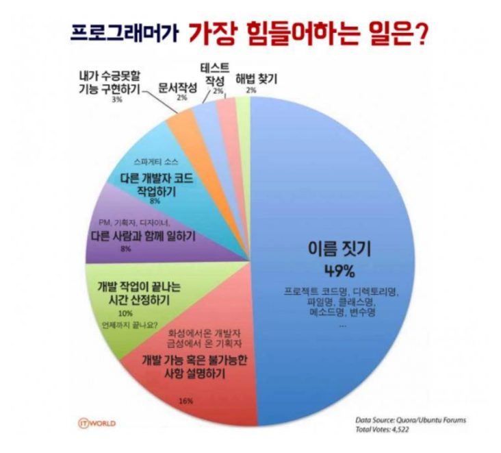

2장. 의미 있는 이름  
=======================
## 개발자의 어려운 업무. 49%의 Naming  


<br>
<br>

## 의도를 밝혀야한다.
### 주석 없이 어떤 일을 하는지, 어떤 데이터를 가지고 있을지 알 수 있어야한다.  
<br>  

Ex) 주석 없이 변수명만으로 변수의 의도를 나타낸다.
|Bad|Good|
|---|---|
|int d; //결과 시간(단위: 날짜)  |int elapsedTimeInDays;     |
|                               |int daysSinceCreation;     |
|                               |int daysSinceModification; |
|                               |int fileAgeIndays;         |

<br>

Ex) 도메인 지식이 없다면 읽기 어려운 코드이다. 변수 안에 어떤 데이터가 담겨있을지 파악하기 힘들다.
<!-- 코드블록내에 bold, underline 삽입 찾아보기 -->
<table>
 <tr>    
  <th>Bad</th>
  <th>Good</th>
  <th>Better</th>
 </tr>
 <tr>
  <td>

```java
List<int[]> list1 = new ArrayList<int[]>();
for(int[] x : *theList*)
    if(x[*0*]==*4*)
        list1.add(x);
        return list1;
```
  </td>
  <td>

```java
List<int[]> *flaggedCells* = new ArrayList<int[]>();
for(int[] *cell* : *gameBoard*)
    if(cell[*STATUS_VALUE*] == *FLAGGED*)
        flaggedCells.add(cell);
return flaggedCells;
```
  </td>
  <td>

```java
List<*Cell*> flaggedCells = new ArrayList<Cell>();
for(*Cell* cell: gameBoard)
    if(cell.*isFlagged*())
        flaggedCells.add(cell);
return flaggedCells;
```
  </td>
 </tr>
</table>

<br>

## 그릇된 정보를 피해라
    1. Domain specific한 단어는 사용하지 않는다.
    2. 뜻에 맞지 않는 단어는 사용하지 않는다.
    3. 읽기 어려운 경우

Ex)   
1. Domain specific한 경우  
   - hp
     - 유닉스 플랫폼, 유닉스 변종
     - 직각삼각형의 빗변(hypotenuse)

2. 뜻에 맞지 않는 경우
   - List
     - 실제 List 자료구조를 사용한 경우 사용한다.
     - 여러 데이터의 묶음이라면 Group, 복수형(s)을 사용한다.

3. 읽기 어려운 경우
   - 대문자 i / 소문자 L
     - I(대문자 i)
     - l(소문자 L)
    - 알파벳 O / 숫자 0
     - O / o(알파벳)
     - 0 (숫자)

<br>

## 의미있게 구분하라  

<br>

Ex) 의미 있는 이름 사용
|Bad|Good|
|---|---|
|void copyChars(char `a1`[], char `a2`[])|void copyChars(char `source`[], char `destination`[])|

Ex) 의미 없는 단어 제외(자료형, 포괄적인 단어)
|Bad|Good|
|---|---|
|Name`String`|Name|
|Customer`Object`|Customer|
|getActiveAccount`Info`()|getActivityAccount()|
|Money`Amount`|Money|
|account`Data`()|accont|

<br>

## 발음하기 쉬운 단어를 사용한다.

Ex) 발음하기 어려우면 의사소통하기 힘들다.
|Bad|Good|
|---|---|
|Date genymdhms;|Date generationTimestamp|

> Kim: 혹시 젠와이..엠디에이치..ㅇ메에스가 어쩌고 저쩌고  
> &nbsp;&nbsp;&nbsp;&nbsp;&nbsp;&nbsp;&nbsp;&nbsp;&nbsp;&nbsp;&nbsp;&nbsp;&nbsp;&nbsp;&nbsp;&nbsp;&nbsp; vs  
> Kim: 혹시 제너레이션 타임스탬프가 ~~~  

<br>

## 검색하기 쉬운 이름을 사용한다.

Ex) 검색 결과가 중복되는 경우를 염두해두자.
|Bad|Good|Better|
|---|---|---|
|update()|updateStatus()|updateDeviceStatus()|
|       |               |updateUserStatus()|
|       |updateDexcription()|updateAppDescripion()|
|       |                   |updateSettingsDescription()|


Ex) 상수는 const로 선언하여 사용한다.
|Bad|Good|
|---|---|
|5|WORK_DAYS_PER_WEEK|


<br>

## 인코딩을 피하라(IDE의 지원)

1. 데이터 타입은 적지 않는다.
2. 멤버 변수, 인터페이스, 구현 클래스용 인코딩을 적지 않는다.

<br>

Ex) 데이터 타입은 적지 않는다.  
- IDE의 지원으로 컴파일하지 않고도 오류를 감지할 수 있다.
- 타임을 바꿀 경우 이름도 바꿔야한다.

|Bad|Good|
|---|---|
|PhoneNumber phone`String`|PhoneNumber phoneNumber|
<br>

Ex) 멤버 변수, 인터페이스, 구현 클래스용 인코딩을 적지 않는다.  
- 역시 IDE의 지원으로 구분이 가능한다.
- 자바 List도 IList<>로 사용하지 않는다.

|Bad|Good|
|---|---|
|String `m`_des             |String description|
|interface `I`ShapeFactory  |interface ShapeFactory|
|class `C`ShapeFactory      |class ShapeFactory|


## 자신의 기억력을 자랑하지 마라
일반적으로 문제 영역이나 해법 영역에서 사용하는 이름을 선택하자.  
Ex) r (개발 당시 문맥을 아니까 어떤 의미인지 알지만 이후에 다시 온다면 어던 의도였는지 알 수 없다.)  
> 대체 이름
> - URL  
> - Radius


## 클래스 이름은 명사/명사구를, 메서드 이름은 동사/동사구를 사용한다.
### 코드는 한 권의 책이고 이야기이다.
Ex)
|Class|Method|
|---|---|
|Customer|
|Account|
|WikiPage|deletePage()|

- 접근자, 변경자, 조건자는 자바빈 표준에 따라 get, set, is를 붙여 사용한다.
- 생성자를 오버로딩 할때는 정적 팩토리 메서드를 사용한다. 
    |Bad|Good|
    |---|---|
    |newComplex(23.0)|Complex.FromRealNumber(23.0)|
    |                 |Complex.FromInteger(25)|

<br>

## 기발한 이름은 피하라
Ex) 특정 문화에서만 사용하는 단어들은 피한다.
|Bad|Good||
|---|---|---|
|holyHandGrenade()  |deleteItems()  |성스러운 수류탄    |
|whack()            |kill()         |구타               |
|eatMyShort()       |Abort()        |내 반바지나 먹어라~|

<br>

## 하나의 개념에 하나의 단어를 사용하라
    - fetch(가져오다), retrieve(검색하다), get은 의미를 구분하기 힘들다. 한개의 대표 단어만 사용하다.
    - controller, manager, driver 역시 한개만 사용하자.

<br>

## 한 단어를 두 가지 목적으로 사용하지 마라
- add
  - 두 값을 더해 새로운 값을 만든다.(add)
  - 자료구조에 값을 추가한다.  
    - insert, append와 적합하다.


## 해법 영역 (기술 개념)에서 가져온 이름을 사용하라.(개발은 개발자가 한다) 적절한 용어가 없다면 문제 영역(domain)에서 가져온 이름을 사용하라  
- 해법 영역
  - Visitor 패턴
  - JobQueue
- 문제 영역
  - domain 용어
      


## 의미 있는 맥락을 추가한다(추측 가능한 맥락)
  1. 스스로 의미가 분명한 이름을 우선 사용한다.
  2. 그렇지 못하다면 클래스, 함수,  namespace에 넣어 맥락을 부여한다.
  3. 그래도 안된다면 접두어를 붙인다.

Ex) Address를 나타내는 변수들.

<table>
 <tr>
  <th>Bad</th>
  <th>Good</th>
  <th>Better</th>
</tr>
<tr>
 <td>String firstName</td>
 <td>String addrFirstName</td>
 <td rowspan=4>
 
 ```java
 class Address{
     String firstName
     String lastName
     String street
     String state
 }
 ```
 </td>
</tr>
<tr>
 <td>String lastName</td>
 <td>String addrLastName</td>
</tr>
<tr>
 <td>String street</td>
 <td>String addrStreet</td>
</tr>
<tr>
 <td>String state</td>
 <td>String addrState</td>
</tr>
</table>

## 불필요한 맥락을 없애라
일반적으로 짧은 이름보다 긴 이름이 좋지만 긴 이름을 위해 불필요한 맥락을 추가하지 않아야 한다.  
Ex)

|   |Bad|Good|
|---|---|---|
|포트 주소|PostalAddress|PostalAddress|
|MAC 주소|MACAddress|MAC|
|웹 주소|WebAddress|URI|

<br>

------------------------
<br>

## Examples

|Bad|Good|
|---|---|
|cat|cat|
|   |category|
|n  |name|
|w  |weight|
|toggle()|toggleCountrySelection()|